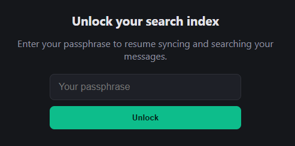
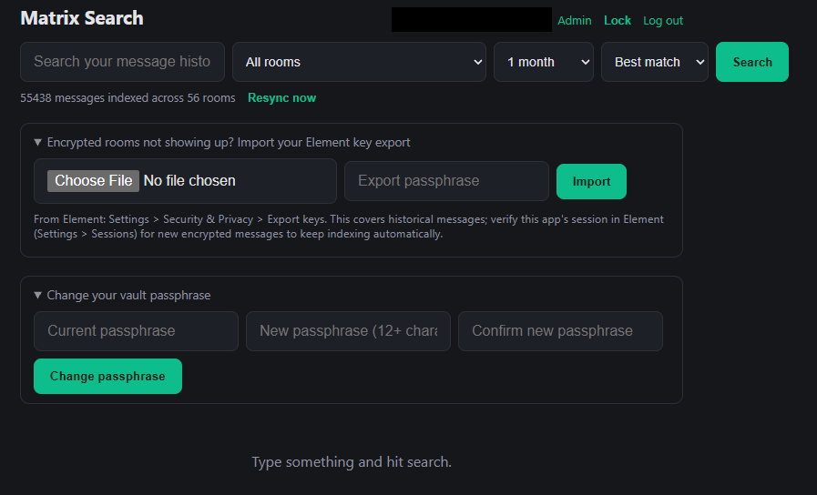
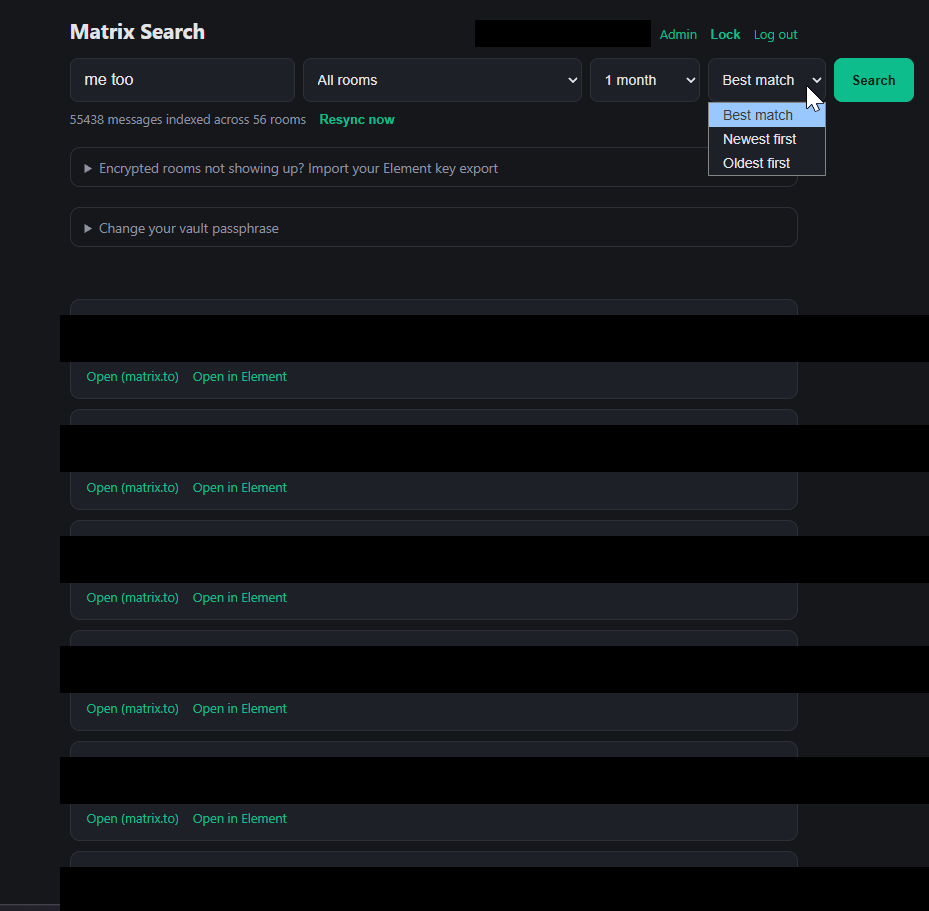
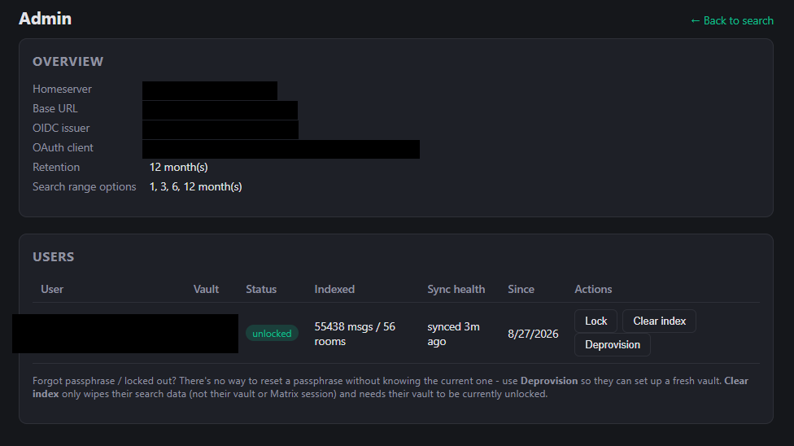

# matrix-search-hub

A centralized, multi-user version of [matrix-search](https://github.com/mspencerl87/matrix-search):
one deployment that any employee can sign into with their own company
account, each getting their own searchable index of their own Matrix
message history. Nobody else - including the person running this server -
can read it without that user's own passphrase.

## Screenshots

<table>
<tr>
<td><br>Sign in</td>
<td><br>Unlock (after a restart)</td>
</tr>
<tr>
<td><br>Search - range/sort/room filters, resync, key import, passphrase change</td>
<td><br>Results with highlighted matches (redacted for this README)</td>
</tr>
</table>



*Admin panel - deployment overview and per-user sync health (redacted for this README).*

## How login works

1. A user clicks **Sign in**, which redirects them to your identity
   provider's real login page with a PKCE challenge and a freshly generated
   Matrix device ID embedded in the OAuth scope, per MSC2967.
2. They authenticate there exactly as they would signing into Element.
3. The provider redirects back to `/auth/callback` with an authorization
   code, exchanged server-side for an access token + refresh token - this
   becomes that user's own dedicated Matrix session/device.
4. The app registers itself as an OAuth client automatically on first
   startup via dynamic client registration (no admin action needed) and
   caches the result in `data/oauth_client.json`.

This only works against a homeserver running **OIDC-native auth**
([MSC2965](https://github.com/matrix-org/matrix-spec-proposals/pull/2965) /
Matrix Authentication Service). Check with:

```bash
curl -s https://<your-server-name>/.well-known/matrix/client
```

If the response has an `org.matrix.msc2965.authentication` block, you're
good. If not, this app can't use your homeserver's auth - use the
single-user `matrix-search` project instead.

Note that `<your-server-name>` above (the domain in user IDs, e.g.
`vates.tech` for `@you:vates.tech`) is frequently a **different host**
than `MATRIX_HOMESERVER` (e.g. `matrix.vates.tech`), since `.well-known`
delegation exists precisely so the client-server API can live somewhere
else. This app needs both: `MATRIX_HOMESERVER` for actual API calls, and
`MATRIX_SERVER_NAME` (defaults to `MATRIX_HOMESERVER` if unset) for this
`.well-known/matrix/client` discovery step specifically. Getting this
wrong is the most common startup failure - it shows up as a JSON decode
error fetching `.well-known/matrix/client`, because the API host still
returns HTTP 200 for that path instead of a clean 404.

## Encryption model - read this before deploying

Every user's messages and Matrix session tokens are stored in a
**per-user, passphrase-encrypted database** (`data/users/<user>/vault.db`,
via SQLCipher). Nobody can read a user's data without that specific
passphrase - not an admin with full filesystem access, not a database
backup, not anyone else at the company. That passphrase:

- is set by the user themselves the first time they use the app (separate
  from their SSO password),
- is never sent anywhere but that one request, and never stored anywhere,
  not even hashed - the only proof it's correct is that it successfully
  decrypts that user's existing vault,
- lives only in server memory, only for as long as that user's sync worker
  is running.

**What this actually defends against:** someone pulling the database, a
backup, or raw files off disk gets nothing readable. A "just export this
person's messages" request has no technical answer unless that person
unlocks it themselves.

**What this does *not* defend against**, and it's worth being honest about
both:
1. Someone directly compelling a user to type their own passphrase under
   pressure - that's a policy/HR/legal problem, not one encryption solves.
2. Whoever controls what code actually runs on this server modifying it to
   capture passphrases as they're typed. If the same people you're
   protecting data from also control deployment of this app, no amount of
   application-level encryption closes that gap - it needs independent
   code review/audit, or hosting this somewhere that party doesn't control.

### What this means day to day

- **First time:** after signing in, a user sets their passphrase and
  indexing starts immediately - full backfill, then live sync, same as
  before.
- **Normal use:** once unlocked, everything behaves exactly as you'd
  expect - instant search, live indexing, no repeated prompts. The
  passphrase stays resident in server memory for the life of the process.
- **After a restart** (deploy, host reboot, crash): every user's worker is
  paused - **nothing auto-resumes**, by design, since resuming would mean
  the key survived the restart somewhere, which defeats the point. Each
  person needs to visit the app and unlock again before their indexing
  picks back up. This is the entire cost of the model: an occasional
  re-unlock, not degraded search.
- **If someone forgets their passphrase:** there is no recovery. Their
  vault is unreadable, by design - the whole guarantee rests on nobody but
  them being able to open it. An admin can only delete their vault file
  (`data/users/<user>/vault.db`) so they can set up a fresh one; the old
  index is gone.
- Users can also click **Lock** to proactively evict their key from server
  memory before walking away from a shared or untrusted machine.
- Users can change their own passphrase from the search UI ("Change your
  vault passphrase" panel) - this requires their *current* passphrase and
  rekeys the vault in place with no data loss. This is different from a
  forgotten passphrase, which nobody, including an admin, can recover or
  reset (see the Admin panel section).

## Search range & retention

Two related but distinct settings:

- **Search range** - a dropdown in the search UI (1 / 3 / 6 / 12 months,
  default 1 month) that limits how far back a given search scans, for
  speed. Options beyond `RETENTION_MONTHS` are hidden since there'd be
  nothing to find past that anyway.
- **Retention** (`RETENTION_MONTHS`, default `12`) - the actual cap on how
  much history is ever stored per user, admin-configured via env var.
  Backfill stops paging back once it reaches messages older than this, and
  a background job prunes anything already stored that ages out over
  time. Raising it only affects newly-indexed and future data - it does
  not retroactively recover messages that were already pruned or never
  backfilled under a lower setting.

This also has a privacy benefit worth noting given the encryption model
above: less decrypted history ever sitting on disk at all, encrypted or
not, is less exposure if anything ever does go wrong.

## Setup

1. Copy the env file:

   ```bash
   cp .env.example .env
   ```

2. Set `MATRIX_HOMESERVER` (the real API base URL - see above for how to
   find it, since it's often not your account's server name), and
   `MATRIX_SERVER_NAME` if that server name differs from it (it usually
   does - see the note above).

3. Set `BASE_URL` to this app's actual public URL, e.g.
   `https://matrix-search.internal.example.com`. This becomes the OAuth
   `redirect_uri` (`{BASE_URL}/auth/callback`), which must be reachable by
   every user's browser and generally needs to be `https://` - put this
   behind a reverse proxy with a real certificate (Caddy/Traefik/nginx)
   rather than exposing plain HTTP directly.

   Once people are using the app, don't change `BASE_URL` without also
   deleting `data/oauth_client.json` to force re-registering the OAuth
   client with the new redirect URI.

4. Generate a session secret:

   ```bash
   openssl rand -hex 32
   ```

   Put the output in `SESSION_SECRET`. Keep it stable - rotating it logs
   everyone out (their vaults are unaffected, they just need to unlock
   again).

5. Optionally adjust `RETENTION_MONTHS` (default `12`) and set
   `ADMIN_USER_IDS` (comma-separated) if anyone should have admin access.

6. Build and start:

   ```bash
   docker compose up -d --build
   docker compose logs -f
   ```

   On first startup you should see `Discovered OIDC issuer: ...` and
   `Dynamically registered new OAuth client ...`. If registration fails
   because the provider has no `registration_endpoint`, an admin needs to
   register a client manually and you set `OAUTH_CLIENT_ID` /
   `OAUTH_CLIENT_SECRET` instead (redirect URI: `{BASE_URL}/auth/callback`).

7. Open `http://<host>:8080` (or wherever you've mapped/proxied it), sign
   in, and set a passphrase.

## Encrypted Matrix rooms

Separate from the vault passphrase above - this is about Matrix's own
end-to-end encryption for individual rooms. Each user's login creates a
brand-new Matrix device with none of the room keys needed to decrypt their
encrypted (E2EE) rooms yet. From the search UI:

- **Historical messages:** the "Import your Element key export" panel -
  export keys from Element (Settings > Security & Privacy > Export keys)
  and upload the file with its passphrase (a different passphrase from
  the vault one). Triggers a background re-scan that picks up whatever's
  now decryptable.
- **New messages going forward:** each user should verify this app's
  session from their own Element (Settings > Sessions, look for
  `matrix-search-hub`) using their own recovery key, so their other
  devices share future room keys with it automatically.

Unencrypted rooms need none of this - they index automatically for
everyone.

## Troubleshooting

General approach: `docker compose logs -f` while reproducing the problem,
then grep for the relevant symptom below.

**Login / OAuth failures**

- `JSONDecodeError` fetching `.well-known/matrix/client` at startup - a
  `MATRIX_SERVER_NAME`/`MATRIX_HOMESERVER` mixup (see the note under "How
  login works" above). Verify with:
  ```bash
  curl -s https://<your-server-name>/.well-known/matrix/client
  ```
- `Client registration failed ... invalid redirect_uri; invalid client_uri`
  - `client_uri` (defaults to `BASE_URL`) isn't an HTTPS URL your identity
  provider accepts. A bare LAN IP over `http://` typically fails this.
- `Client registration failed ... invalid redirect_uri` (generic, no
  mention of client_uri) - `client_uri` and `redirect_uri` (built from
  `BASE_URL`) must share the same origin. Don't point `OAUTH_CLIENT_URI`
  somewhere else unless you're sure your provider doesn't enforce this.
- Browser shows `ERR_SSL_PROTOCOL_ERROR` on the callback URL - `BASE_URL`
  has `https://` but nothing is actually terminating TLS in front of the
  app. Either fix `BASE_URL` to match reality, or put a real reverse proxy
  with TLS in front and point `BASE_URL` at that (most identity providers
  reject plain-HTTP redirect URIs outright anyway, so you'll usually need
  the proxy regardless).
- `Authorization grant ... already used` - you reloaded or revisited a
  stale callback URL from an earlier attempt. Authorization codes are
  single-use and short-lived; start over from `/auth/login` in a fresh
  tab rather than reloading an old one.
- After fixing a `BASE_URL`/OAuth config issue, the log still says
  `Reusing previously registered OAuth client ...` with the same old
  client ID - `data/oauth_client.json` wasn't actually deleted. It's
  often owned by `root` (created by the Docker daemon), so a plain `rm`
  can silently fail for a non-root user - confirm with `ls -la
  data/oauth_client.json` after deleting, and use `sudo rm -f` if needed.

**Encrypted rooms / a specific message not showing up**

If `docker compose logs | grep -i "backfill complete"` shows `0 events
could not be decrypted` but a message you know exists still isn't
findable:

- Check whether that event is being seen at all:
  ```bash
  docker compose logs | grep -i "UNDECRYPTABLE\|no prev_batch"
  ```
- Every event gets logged individually as it's processed - `indexing
  event`, `SKIP (older than retention cutoff)`, or `UNDECRYPTABLE` - so
  grepping for the room name or a snippet of the message text can confirm
  whether it was ever seen at all versus silently missed.
- Per-room sync summaries (`sync timeline for <room>: N event(s),
  limited=...`) show how many events came back for a room on a given
  sync pass, and whether a `prev_batch` token was present to page further
  back from.
- A stale key export is the most common cause of "this recent message
  isn't found" even when decryption otherwise looks completely healthy -
  a key export only covers sessions that existed at the moment you
  created it. Re-export from Element immediately before importing again
  if you need current coverage.

**General log filters**

```bash
docker compose logs -f                                # live tail
docker compose logs | grep -i error                    # anything that errored
docker compose logs | grep -i "backfill complete"       # per-user summaries + undecryptable counts
docker compose logs | grep -i "backfill failed"         # per-room exceptions during backfill (caught, not fatal)
docker compose logs | grep -i "oauth client"            # confirms fresh vs. reused client registration
docker compose logs | grep -i "unlocked and started"    # confirms a user's vault actually unlocked
```

## Admin panel

Anyone whose Matrix user ID is listed in `ADMIN_USER_IDS` sees an **Admin**
link in the search UI, leading to `/admin.html`. This isn't limited to one
person - `ADMIN_USER_IDS` takes a comma-separated list, so any number of
people can have admin access (`ADMIN_USER_IDS=@a:example.com,@b:example.com`).
It shows, and only shows, metadata:

- Deployment overview: homeserver, base URL, OIDC issuer, OAuth client,
  retention setting.
- A table of every user who's ever signed in: their device ID, whether
  they've set up a vault, whether it's currently unlocked, indexed
  message/room *counts* (only while unlocked, never content), and sync
  health - when their sync last actually succeeded, how many events
  couldn't be decrypted, and the last error if there's one currently.
- **Lock** - force-evicts a user's key from server memory right now,
  without deleting anything. Useful for incident response (e.g. a stolen
  laptop with an active session) without touching their data.
- **Clear index** - wipes a user's search data only (their vault and
  Matrix session/tokens are untouched) and starts a fresh resync
  automatically. Only available while their vault is unlocked, since
  clearing it means writing to their encrypted database. Useful when
  someone's search seems stuck or wrong and a resync alone (self-service,
  via the "Resync now" button they have themselves) doesn't fix it.
- **Deprovision** - permanently deletes a user's vault, indexed messages,
  and Matrix crypto store. Requires typing their user ID to confirm; there
  is no undo. Use this for offboarding, **and** for a forgotten passphrase -
  there is no way to reset or recover a passphrase without knowing the
  current one (see below), so starting over is the only option.

There is deliberately no way for an admin to read a user's messages or
open their vault without their passphrase - that would defeat the entire
point of the encryption model above. Admin here means "can manage
accounts," not "can read anyone's data." This is also why there's no
"reset passphrase" action: changing an encryption key requires already
knowing the current one, so the only two real options for a locked-out
user are (a) they remember it, or (b) Deprovision and start fresh.

## Data & security notes

- `data/users/<user>/vault.db` holds that user's decrypted messages and
  Matrix OAuth tokens, encrypted at rest with their passphrase (SQLCipher).
  This is the only place either lives.
- `data/control.db` is intentionally minimal and unencrypted: just which
  user IDs have used the app and their device ID, so the UI can show
  "unlock" vs "set up". No tokens or message data.
- `data/oauth_client.json` holds this app's own OAuth client secret if one
  was issued. Don't commit it or expose it.
- Logging out only clears the browser session cookie - if the vault is
  still unlocked in server memory, the background sync worker keeps
  running so the index stays current. Use **Lock** (or a restart) to
  actually evict a user's key from memory.
- To fully deprovision someone who's left the company, use the admin
  panel's **Deprovision** button (or the API below) rather than deleting
  files by hand - it makes sure their sync worker is stopped first.

## API

- `GET /api/me` — current session's user_id and is_admin, or 401.
- `GET /api/vault-status` — `{exists, unlocked, has_pending_login}` for
  the logged-in user.
- `POST /api/vault/setup` — `{passphrase}`, first-time vault creation.
- `POST /api/vault/unlock` — `{passphrase}`, resumes an existing vault.
- `POST /api/vault/lock` — evicts the key from memory, stops syncing.
- `POST /api/vault/change-passphrase` — `{current_passphrase,
  new_passphrase}`, rekeys the vault in place; 401 if the current
  passphrase is wrong.
- `GET /api/config` — search range options and retention, for the UI.
- `GET /api/rooms` — distinct `{room_id, room_name}` pairs the logged-in
  user has indexed messages from, for the search UI's room filter.
- `GET /api/search?q=...&limit=50&months=1&sort=relevance&room_id=...` —
  search results for the logged-in user's unlocked vault only; 423 if
  locked. `sort` is one of `relevance` (default), `newest`, or `oldest`;
  `room_id` (optional) restricts to one room.
- `GET /api/status` — indexed message/room counts; 423 if locked.
- `POST /api/resync` — re-runs a full sync + backfill in the background
  for the logged-in user, without needing a key import. Useful if you
  suspect indexing stalled or missed something.
- `POST /api/import-keys` — multipart `file` + `passphrase`, imports a
  Matrix room-key export and triggers the same background re-scan as
  `/api/resync`.
- `GET /api/admin/overview`, `GET /api/admin/users` — admin-only, metadata
  as described above (the latter includes each user's sync health).
- `POST /api/admin/users/{user_id}/lock`,
  `POST /api/admin/users/{user_id}/clear-index` (409 if that user is
  locked), `POST /api/admin/users/{user_id}/deprovision` — admin-only.
